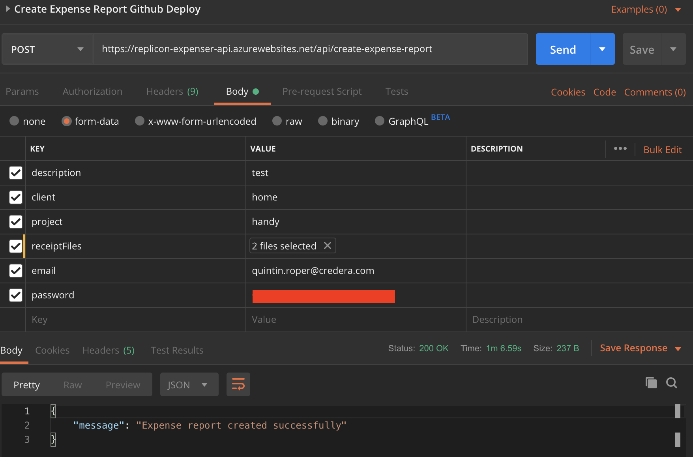

# Replicon Auto-Expenser

Take pictures of your receipts, name them in a specific format, then execute this script to automatically create, fill out, and save your expense sheet in Replicon.

# Steps to Run

1. Name your expense receipt images and put them in a folder:

   ```
   2019-09-06_Meal_Dinner_Elways_$13.22.png
   YYYY-MM-DD_{MealType}_{Purpose}_{Place}_{Amount}.png
   MealTypes = ['Travel', 'Meal', 'Training']
   ```

2. Download [Postman](https://www.getpostman.com/downloads) or another API program
3. Create the expense report API call in Postman with the information in the following image:   
   **The `password` field in the API call is base64 encoded**

4. Navigate to ./replicon-expenser-server
5. Install NodeJS
6. Install Dependencies

   `npm install`

7. Start the server

   `node server.js`

8. Click `Send` in Postman to create expense report
